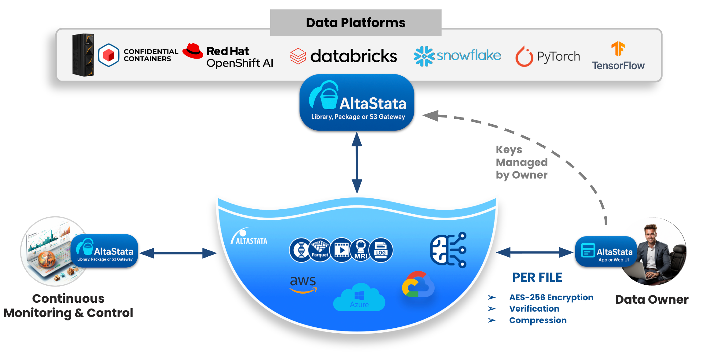
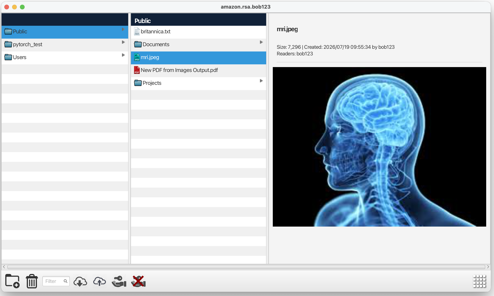

# AltaStata

**Sovereign Data Fabric** for any storage — S3, Azure, GCP, Posix, IBM, MinIO, Fusion, and more.

Organizations exchange data with partners, store it in clouds under foreign jurisdiction, and send it to AI data centers to use external GPUs. How do you keep sovereignty on someone else’s territory? Through **per-file cryptographic control**. But encryption usually slows pipelines — and most tools cannot work on encrypted data.

AltaStata is built for that gap: end-to-end, per-file protection **without losing speed** across data pipelines and the AI supply chain. **Post-quantum** cryptography (ML-KEM / ML-DSA) is available in **Enterprise**; Community uses RSA. With **data compression**, you can even **boost throughput** and **lower storage costs**.

Each uploaded file is **immutable**. That is **cryptographically guaranteed**
by **AES-256-GCM**: even the owner cannot modify the file in place.
If a change is needed, the owner creates a **new version**.

### Background

MIT researchers. Technology covered by [**US Patent No. 10,693,660**](https://patents.google.com/patent/US10693660B2).

## Featured by Red Hat and IBM

- [Red Hat: end-to-end security for AI (OpenShift confidential containers)](https://www.redhat.com/en/blog/end-end-security-ai-integrating-altastata-storage-red-hat-openshift-confidential-containers) — [video](https://www.youtube.com/watch?v=2EGncReIi00)
- [IBM: data sovereignty for AI (LinuxONE Confidential Computing)](https://community.ibm.com/community/user/blogs/savita-kumari/2026/06/24/data-sovereignty-for-ai-integrating-alta-stata)

## Integration

The [AltaStata python package](https://github.com/AltaStata/altastata-python-package) — CLI, SDK, fsspec, PyTorch, TensorFlow, LangChain, S3.

The [HDFS client](docs/guides/UBER_JARS.md) (`altastata-hadoop`) — Spark, Databricks, Hive, Flink, HBase (`altastata://`).

---

## Getting started

Community vs Enterprise: [ENTERPRISE.md](docs/guides/ENTERPRISE.md).

| Step | Who | What to do |
|------|-----|------------|
| **1. Keys** | You | [Desktop UI](docs/guides/USER_SETUP_GUIDE.md#desktop-ui-altastata-ui) or [Create keys using CLI](https://github.com/AltaStata/altastata-python-package/blob/main/docs/guides/USER_SETUP_GUIDE.md#create-keys-cli--sdk) below. Send the **public key** to your org admin. |
| **2. Provision** | Org admin | [Admin Tool](https://github.com/AltaStata/sovereign-data-fabric/blob/main/docs/guides/ADMIN_TOOL_GUIDE.md) output: `~/.altastata/admin/properties.<cloud>/` ([§3.2](https://github.com/AltaStata/sovereign-data-fabric/blob/main/docs/guides/ADMIN_TOOL_GUIDE.md#32-output-paths)); send `*user.properties` to the user. |
| **3. Account directory** | You | Drop `*user.properties` in `~/.altastata/accounts/<name>/` next to your keys → [connect from Python](#integration) below. Paths & logs: [USER_SETUP](docs/guides/USER_SETUP_GUIDE.md). |

Then pick a client below (Desktop, Java, Python, S3 gateway, …).

---

## Work with the sovereign data fabric

### 1. Desktop UI (`altastata-ui`)

File explorer for end users. [Releases](https://github.com/AltaStata/sovereign-data-fabric/releases) · [USER_SETUP_GUIDE.md](docs/guides/USER_SETUP_GUIDE.md).

### 2. Java / Scala SDK (`altastata-core`)

Scala is the low-level `CloudFile` API (`Account` + `fileSystemModel`) — [Low-level-Scala-API.md](docs/guides/Low-level-Scala-API.md).

Java `AltaStataFileSystem` is syntactic sugar over the same model — [HOWTO.md](docs/guides/HOWTO.md).

Samples: [altastata-examples](altastata-examples/README.md).
Download time vs native GCS / Azure Blob: [README-performance.md](altastata-examples/docs/README-performance.md).

API reference: [Javadoc](https://altastata.github.io/sovereign-data-fabric/api/javadoc/) · [Scaladoc](https://altastata.github.io/sovereign-data-fabric/api/scaladoc/com/altastata/filesystem/securecloud/).

Python SDK, CLI, and integrations: [AltaStata python package](https://github.com/AltaStata/altastata-python-package).

### 3. HDFS client (`altastata-hadoop`)

Automatically integrates **Spark**, **Databricks**, **Hive**, **Flink**, **HBase**, and graph/SQL layers on HBase such as **JanusGraph** and **Apache Phoenix** with the data fabric (`altastata://` scheme).

Download the Hadoop uber JAR from [Releases](https://github.com/AltaStata/sovereign-data-fabric/releases) and put it on the Spark classpath — [how to use the uber JARs](docs/guides/UBER_JARS.md).

### 4. Services uber JAR (`altastata-services`)

Download the Services uber JAR from [Releases](https://github.com/AltaStata/sovereign-data-fabric/releases) and run it — [how to use the uber JARs](docs/guides/UBER_JARS.md). One process exposes:

| Endpoint | Port / mode | What it is for |
|----------|-------------|----------------|
| **S3** (`altastata-s3-gateway`) | `:9876` | **AWS CLI**, **Snowflake**, and other S3 clients; data stays encrypted end-to-end |
| **gRPC** (`altastata-grpc`) | `:9877` | Typed RPC for custom clients; protos under `altastata-grpc/src/main/proto/altastata/grpc/v1/` |
| **Web Console** | `http://127.0.0.1:9877` | Finder-style file manager (set `ALTASTATA_WEB_UI_DIR` when starting Services) |
| **MCP** (`altastata-mcp`) | `--mcp-stdio` | Claude Desktop / Cursor over stdio (off by default); Python: `altastata mcp` |

**Web Console login:** select the **account directory** on the machine running Services (e.g. `~/.altastata/accounts/amazon.rsa.bob123`) — it must already contain `*user.properties` and keys ([USER_SETUP_GUIDE.md](docs/guides/USER_SETUP_GUIDE.md)).

**MCP:** bind the same account directory; see [altastata-mcp/README.md](altastata-mcp/README.md).

### Example Docker images

See **[CONTAINERS.md](docs/guides/CONTAINERS.md)** for the GitHub Packages (GHCR)
container images and the Community/Enterprise account-directory mount pattern.

---

## Docs & licensing

| Document | Contents |
|----------|----------|
| [Releases](https://github.com/AltaStata/sovereign-data-fabric/releases) | Desktop UI, Admin Tool, Hadoop / Services uber JARs |
| [HOWTO.md](docs/guides/HOWTO.md) | Upload, download, versions, share, revoke, delete, search, streams, events — Desktop, Console, Java, S3 |
| [Low-level-Scala-API.md](docs/guides/Low-level-Scala-API.md) | Same tasks via `Account` + `CloudFile` (Scala) |
| [USER_SETUP_GUIDE.md](docs/guides/USER_SETUP_GUIDE.md) | End users — keys (Desktop UI or Python CLI), account folder |
| [ADMIN_TOOL_GUIDE.md](docs/guides/ADMIN_TOOL_GUIDE.md) | Install Admin Tool; Community vs Enterprise; create your fabric |
| [ENTERPRISE.md](docs/guides/ENTERPRISE.md) | Enterprise mode: Custodian access manager, PQC, HSM/HPCS, org CA |
| [UBER_JARS.md](docs/guides/UBER_JARS.md) | Hadoop JAR for Spark / Databricks; Services JAR for S3, gRPC, Console, MCP |
| [CONTAINERS.md](docs/guides/CONTAINERS.md) | GitHub Packages — mount account directory (Community & Enterprise) |
| [DEVELOPERS_GUIDE.md](docs/guides/DEVELOPERS_GUIDE.md) | Build from source, JVM, tests, deploy services |
| [README-performance.md](altastata-examples/docs/README-performance.md) | Download time vs native GCS / Azure Blob (Aug 2026) |
| [API docs](https://altastata.github.io/sovereign-data-fabric/api/javadoc/) | Javadoc (`api`) · [Scaladoc](https://altastata.github.io/sovereign-data-fabric/api/scaladoc/com/altastata/filesystem/securecloud/) (`FileSystemModel`, Streams) |
| [SECURITY.md](SECURITY.md) | How to report a vulnerability; credential handling rules |
| [SUPPORT.md](SUPPORT.md) | Where to ask a question or file a bug |
| [CONTRIBUTING.md](CONTRIBUTING.md) | How to contribute, report issues, and CLA terms |
| [LICENSE.md](LICENSE.md) | Business Source License 1.1 |
| [LICENSE_FAQ.md](LICENSE_FAQ.md) | Plain-English licensing summary and Community FAQ |

### Security

Found a vulnerability? Report it privately — **do not open a public issue**. See
**[SECURITY.md](SECURITY.md)** for the reporting channels and what to include.

Ensure you **never commit credentials**, account directories, or private key
material to version control.

### Licensing

AltaStata is **source-available under Business Source License 1.1** — **not** open source today.

Free production use is limited to **Evaluation / PoC** or the **Community Tier** (see [LICENSE.md](LICENSE.md)).

For a plain-English summary and FAQ, see **[LICENSE_FAQ.md](LICENSE_FAQ.md)**.

That FAQ is for convenience only; **LICENSE.md controls** in case of any conflict.

Commercial licensing: `contact@altastata.com`
