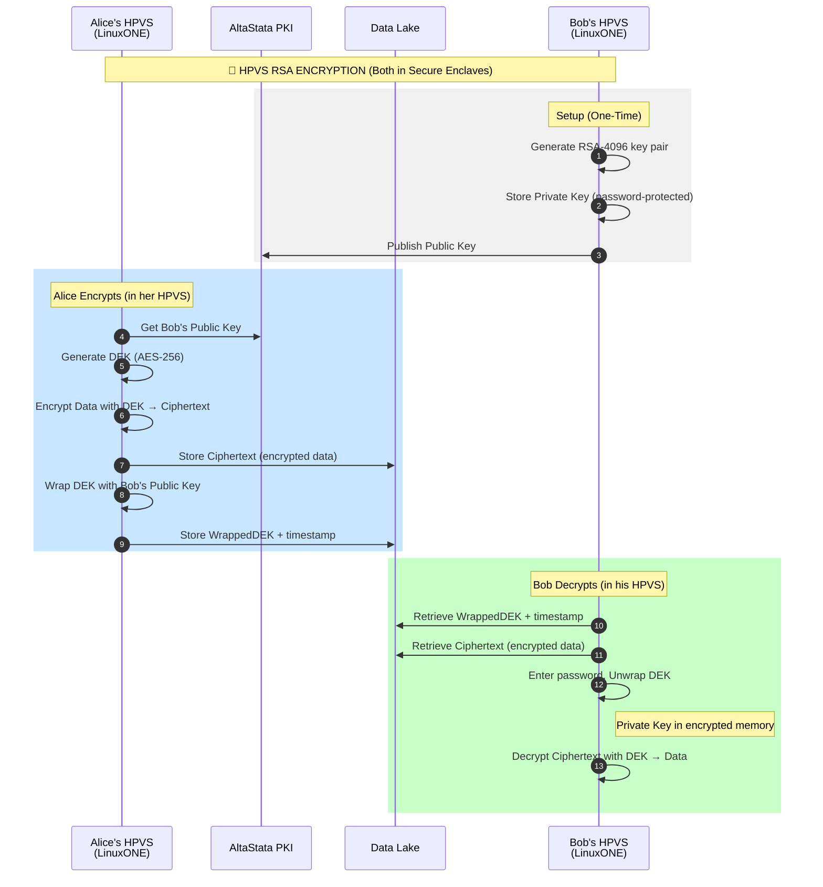
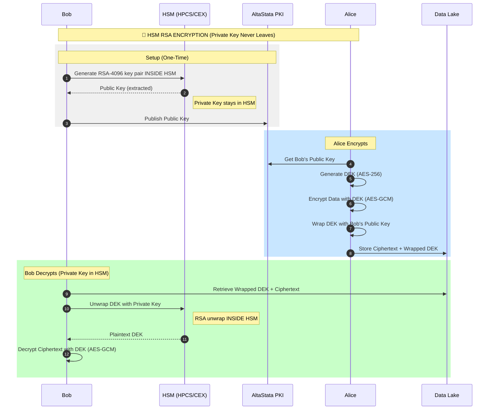
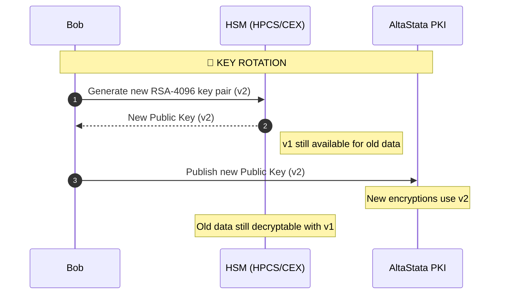

# 🔐 AltaStata HSM Key Management with IBM Hyper Protect

## Overview

Two deployment options for protecting Bob's **User Private Key** (RSA-4096):

| Option | Key Location | Protection | FIPS 140-2 L4 |
|:-------|:-------------|:-----------|:--------------|
| **HPVS** | Secure Enclave (encrypted memory) | Confidential Computing | ❌ No |
| **HSM** | HPCS or CEX hardware | Hardware Security Module | ✅ Yes |

Alice uses **Bob's Public Key** (from AltaStata PKI) to wrap data encryption keys.

---

# 🖥️ OPTION 1: HPVS (Secure Enclave)

## Overview

Both **Alice** and **Bob** run their applications in HPVS (Hyper Protect Virtual Server) on LinuxONE. Each has their own secure enclave with **encrypted memory**. IBM cannot access either.

```
┌──────────────────────────────────────────────────────────────────────────┐
│  HPVS - Confidential Computing (Both Parties)                           │
│                                                                          │
│  ┌─────────────────────────┐         ┌─────────────────────────┐       │
│  │  ALICE'S HPVS           │         │  BOB'S HPVS             │       │
│  │  (LinuxONE)             │         │  (LinuxONE)             │       │
│  │                         │         │                         │       │
│  │  • Encrypts data        │         │  • Decrypts data        │       │
│  │  • Uses Bob's Public Key│         │  • Has Private Key      │       │
│  │    from PKI             │         │    (password-protected) │       │
│  └─────────────────────────┘         └─────────────────────────┘       │
│                                                                          │
│  ✅ IBM cannot access either (Confidential Computing)                   │
│  ✅ Private Key in Bob's encrypted memory                               │
│  ❌ Not FIPS 140-2 Level 4 (no HSM hardware)                            │
└──────────────────────────────────────────────────────────────────────────┘
```

## HPVS Architecture

```
┌──────────────────────────────────────────────────────────────────────────┐
│                        HPVS KEY HIERARCHY                                │
│                                                                          │
│  ┌─────────────────────────────────────────────────────────────────────┐ │
│  │                     BOB'S RSA KEY PAIR                              │ │
│  │                                                                      │ │
│  │   ┌─────────────────────┐       ┌─────────────────────┐            │ │
│  │   │  Bob's Public Key   │       │  User Private Key   │            │ │
│  │   │    (RSA-4096)       │       │  (RSA-4096 + pwd)   │            │ │
│  │   └──────────┬──────────┘       └──────────┬──────────┘            │ │
│  │              │                             │                        │ │
│  │              ▼                             ▼                        │ │
│  │   ┌─────────────────────┐       ┌─────────────────────┐            │ │
│  │   │  AltaStata PKI      │       │  Bob's HPVS         │            │ │
│  │   │  (Shared with Alice)│       │  (LinuxONE -        │            │ │
│  │   │                     │       │   encrypted memory) │            │ │
│  │   └─────────────────────┘       └─────────────────────┘            │ │
│  └─────────────────────────────────────────────────────────────────────┘ │
│                                                                          │
│  DEK (AES-256) ──► Wrapped by Public Key ──► Stored with Data           │
│                                                                          │
│  Alice runs in her own HPVS (LinuxONE) - gets Public Key from PKI       │
└──────────────────────────────────────────────────────────────────────────┘
```

## HPVS Encryption Flow



## HPVS Key Rotation

Key rotation should be implemented to support multiple versions of Bob's Private Key:

- **New encryptions:** Alice uses the latest Public Key (v2, v3, etc.)
- **Old data:** Bob keeps old Private Keys (v1, v2) to decrypt historical data
- **Key selection:** Based on file timestamp - use the appropriate Private Key for that time period, or try previous version if current fails

---

# 🔐 OPTION 2: HSM (HPCS or CEX)

## Overview

Bob's **User Private Key** (RSA-4096) is stored in IBM HSM. The **Public Key can be extracted** and published to PKI. All private key operations (decrypt, sign) happen **inside the HSM** - the private key never leaves.

```
┌──────────────────────────────────────────────────────────────────────────┐
│  HSM-Generated RSA Key Management                                       │
│                                                                          │
│  • Bob generates RSA-4096 key pair IN the HSM                           │
│  • Public Key: Extracted/exported → Published to AltaStata PKI          │
│  • Private Key: NEVER leaves the HSM                                    │
│                                                                          │
│  • Alice wraps DEK with Bob's Public Key (local, fast)                  │
│  • Bob unwraps DEK with Private Key INSIDE HSM                          │
│                                                                          │
│  ✅ IBM cannot access (private key never leaves HSM)                    │
│  ✅ FIPS 140-2 Level 4 certified                                        │
│  ✅ Public key freely distributed, private key hardware-protected       │
└──────────────────────────────────────────────────────────────────────────┘
```

## HSM Architecture

```
┌──────────────────────────────────────────────────────────────────────────┐
│                        HSM KEY HIERARCHY                                 │
│                                                                          │
│  ┌─────────────────────────────────────────────────────────────────────┐ │
│  │                     BOB'S RSA KEY PAIR                              │ │
│  │                                                                      │ │
│  │   ┌─────────────────────┐       ┌─────────────────────┐            │ │
│  │   │  Bob's Public Key   │       │  User Private Key   │            │ │
│  │   │    (RSA-4096)       │       │    (RSA-4096)       │            │ │
│  │   └──────────┬──────────┘       └──────────┬──────────┘            │ │
│  │              │ EXTRACTED                   │ NEVER LEAVES           │ │
│  │              ▼                             ▼                        │ │
│  │   ┌─────────────────────┐       ┌─────────────────────┐            │ │
│  │   │  AltaStata PKI      │       │  HSM (HPCS or CEX)  │            │ │
│  │   │  (Shared with Alice)│       │  (Operations run    │            │ │
│  │   │  Freely distributed │       │   INSIDE the HSM)   │            │ │
│  │   └─────────────────────┘       └─────────────────────┘            │ │
│  └─────────────────────────────────────────────────────────────────────┘ │
│                                                                          │
│  DEK (AES-256) ──► Wrapped by Public Key ──► Stored with Data          │
│  Metadata ──► Encrypted with AES-GCM using DEK                          │
└──────────────────────────────────────────────────────────────────────────┘
```

## HSM Key Generation & Export

Both HPCS and CEX support generating RSA key pairs **inside the HSM** and extracting the public key:

```
┌─────────────────────────────────────────────────────────────────────────┐
│  KEY GENERATION INSIDE HSM                                              │
│                                                                         │
│  ┌─────────────────────────────────────────────────────────────────┐   │
│  │  HSM (HPCS or CEX)                                              │   │
│  │                                                                  │   │
│  │  1. GenerateKeyPair(RSA-4096)                                   │   │
│  │       ↓                                                          │   │
│  │  ┌──────────────────┐    ┌──────────────────┐                   │   │
│  │  │  Public Key      │    │  Private Key     │                   │   │
│  │  │  (can extract)   │    │  (handle only)   │                   │   │
│  │  └────────┬─────────┘    └────────┬─────────┘                   │   │
│  │           │                       │                              │   │
│  │           ▼                       ▼                              │   │
│  │     EXPORT to PKI           STAYS IN HSM                        │   │
│  └─────────────────────────────────────────────────────────────────┘   │
│                                                                         │
│  Private key operations (decrypt, sign) execute INSIDE the HSM         │
└─────────────────────────────────────────────────────────────────────────┘
```

## HSM Encryption Flow



## Hybrid Encryption (RSA + AES)

RSA-4096 can only encrypt ~446 bytes. AltaStata uses **hybrid encryption**:

```
┌─────────────────────────────────────────────────────────────────────────┐
│  HYBRID ENCRYPTION                                                      │
│                                                                         │
│  1. Generate random DEK (AES-256 key)                                  │
│  2. Encrypt metadata JSON with AES-GCM using DEK                       │
│  3. Wrap DEK with RSA public key                                       │
│                                                                         │
│  Storage: [AES-encrypted-metadata] + [IV] + [RSA-wrapped-DEK]          │
└─────────────────────────────────────────────────────────────────────────┘
```

## HSM Cipher Operations

| Operation | Method | Where |
|:----------|:-------|:------|
| **Wrap DEK** | `cipher.wrap(dek)` | Client-side (public key) |
| **Unwrap DEK** | `cipher.unwrap(wrappedDek)` | Inside HSM (private key) |
| **Encrypt metadata** | AES-GCM | Client-side with DEK |
| **Decrypt metadata** | AES-GCM | Client-side with DEK |

## HPCS Code Example (GREP11)

```java
// === SETUP: Connect to HPCS via GREP11 ===
import com.ibm.cloud.hpcs.ep11.*;

ManagedChannel channel = ManagedChannelBuilder
    .forAddress("ep11.us-south.hs-crypto.cloud.ibm.com", 13412)
    .useTransportSecurity()
    .build();
CryptoGrpc.CryptoBlockingStub ep11 = CryptoGrpc.newBlockingStub(channel);

// === GENERATE KEY PAIR IN HPCS (One-Time Setup) ===
GenerateKeyPairRequest genReq = GenerateKeyPairRequest.newBuilder()
    .setMech(Mechanism.newBuilder().setMechanism(CKM_RSA_PKCS_KEY_PAIR_GEN))
    .setPrivKeyTemplate(getPrivateKeyTemplate("bob-rsa-4096", 4096))
    .setPubKeyTemplate(getPublicKeyTemplate("bob-rsa-4096", 4096))
    .build();
GenerateKeyPairResponse genResp = ep11.generateKeyPair(genReq);
byte[] publicKeyBlob = genResp.getPubKey().toByteArray();   // Extract for PKI
byte[] privateKeyBlob = genResp.getPrivKey().toByteArray(); // Handle only

// === ENCRYPT (Alice - client-side, same as CEX) ===
// Generate DEK, encrypt with AES-GCM, wrap DEK with Bob's public key

// === DECRYPT (Bob - with HPCS) ===
// 1. Unwrap DEK inside HPCS (private key never leaves)
DecryptSingleRequest unwrapReq = DecryptSingleRequest.newBuilder()
    .setMech(Mechanism.newBuilder().setMechanism(CKM_RSA_PKCS_OAEP))
    .setPrivKey(ByteString.copyFrom(privateKeyBlob))
    .setCiphertext(ByteString.copyFrom(wrappedDek))
    .build();
DecryptSingleResponse unwrapResp = ep11.decryptSingle(unwrapReq);
byte[] dekBytes = unwrapResp.getPlain().toByteArray();  // DEK returned

// 2. Decrypt metadata with DEK (client-side AES)
SecretKey dek = new SecretKeySpec(dekBytes, "AES");
Cipher aesCipher = Cipher.getInstance("AES/GCM/NoPadding");
aesCipher.init(Cipher.DECRYPT_MODE, dek, new GCMParameterSpec(128, iv));
byte[] metadataJson = aesCipher.doFinal(encryptedMetadata);
```

## CEX Code Example (PKCS#11)

```java
// === ENCRYPT (Alice - client-side) ===
// 1. Generate DEK
KeyGenerator keyGen = KeyGenerator.getInstance("AES");
keyGen.init(256);
SecretKey dek = keyGen.generateKey();

// 2. Encrypt metadata with AES-GCM
Cipher aesCipher = Cipher.getInstance("AES/GCM/NoPadding");
aesCipher.init(Cipher.ENCRYPT_MODE, dek);
byte[] encryptedMetadata = aesCipher.doFinal(metadataJson.getBytes("UTF-8"));
byte[] iv = aesCipher.getIV();

// 3. Wrap DEK with Bob's public key
Cipher rsaCipher = Cipher.getInstance("RSA/ECB/OAEPWithSHA-256AndMGF1Padding");
rsaCipher.init(Cipher.WRAP_MODE, bobPublicKey);
byte[] wrappedDek = rsaCipher.wrap(dek);

// Store: encryptedMetadata + iv + wrappedDek

// === DECRYPT (Bob - with CEX HSM) ===
KeyStore ks = KeyStore.getInstance("PKCS11", "IBMPKCS11Impl");
ks.load(null, null);
PrivateKey bobPrivateKey = (PrivateKey) ks.getKey("bob-rsa-4096", null);

// 1. Unwrap DEK inside HSM (private key never leaves)
Cipher rsaCipher = Cipher.getInstance("RSA/ECB/OAEPWithSHA-256AndMGF1Padding");
rsaCipher.init(Cipher.UNWRAP_MODE, bobPrivateKey);
SecretKey dek = (SecretKey) rsaCipher.unwrap(wrappedDek, "AES", Cipher.SECRET_KEY);

// 2. Decrypt metadata with DEK (client-side AES)
Cipher aesCipher = Cipher.getInstance("AES/GCM/NoPadding");
aesCipher.init(Cipher.DECRYPT_MODE, dek, new GCMParameterSpec(128, iv));
byte[] metadataJson = aesCipher.doFinal(encryptedMetadata);
```

## HSM Key Rotation



---

# 📊 COMPARISON

## Key Versioning (Both Options)

```
┌──────────────────────────────────────────────────────────────────────────┐
│  KEY STORAGE (HPVS or HSM)                                               │
│                                                                          │
│  User Private Keys (IBM cannot access):                                 │
│                                                                          │
│  • bob-private-key-v1 (2024-01 to 2024-05)  ──► For old data            │
│  • bob-private-key-v2 (2024-06 to 2024-12)  ──► For old data            │
│  • bob-private-key-v3 (2025-01 onwards)     ──► Current (active)        │
│                                                                          │
│  Key selection: Based on file timestamp, or try previous if fails       │
└──────────────────────────────────────────────────────────────────────────┘
```

## Option Comparison

| Aspect | HPVS (Secure Enclave) | HSM (HPCS/CEX) |
|:-------|:----------------------|:---------------|
| **Key Location** | Encrypted memory | HSM hardware |
| **Protection** | Confidential Computing | Hardware Security Module |
| **FIPS 140-2 L4** | ❌ No | ✅ Yes |
| **IBM Access** | ❌ Cannot access | ❌ Cannot access (key in HSM) |
| **Multiple Servers** | ✅ Deploy same key to each HPVS | ✅ All servers call same HPCS |
| **Latency** | ~1-5ms (local) | HPCS: 10-50ms, CEX: 0.5-2ms |
| **Cost** | HPVS VM cost | HSM service cost |

## When to Use Which

| Use Case | Recommended |
|:---------|:------------|
| **Simple, no FIPS required** | HPVS |
| **FIPS 140-2 Level 4 required** | HSM (HPCS or CEX) |
| **Speed priority (single node)** | CEX |
| **Multiple servers need same key** | HPCS (shared via API) or HPVS (deploy same key to each) |

## Data Format

```
┌──────────────────────────────────────────────────────────────────────────┐
│  STORED DATA STRUCTURE                                                   │
│                                                                          │
│  {                                                                       │
│    "ciphertext": "base64-encrypted-data...",                            │
│    "wrappedDEK": "base64-wrapped-dek...",                               │
│    "timestamp": "2025-01-15T10:30:00Z",                                 │
│    "algorithm": "RSA-OAEP-4096"                                         │
│  }                                                                       │
│                                                                          │
│  Key selection: Based on timestamp, use appropriate Private Key         │
└──────────────────────────────────────────────────────────────────────────┘
```

## Terminology

| Term | Description |
|:-----|:------------|
| **HPVS** | Hyper Protect Virtual Server - Confidential Computing VM |
| **HPCS** | Hyper Protect Crypto Services - Cloud HSM |
| **CEX** | Crypto Express - On-prem HSM card |
| **HSM-Generated** | Key pair created inside HSM, private key never leaves |
| **PKI** | Public Key Infrastructure - Key distribution |
| **DEK** | Data Encryption Key - Per-file AES-256 key |

## References

- [IBM full-temperature-wallet-solution](https://github.com/IBM/full-temperature-wallet-solution)
- [IBM Hyper Protect Virtual Servers](https://cloud.ibm.com/docs/vpc?topic=vpc-about-se)
- [IBM Hyper Protect Crypto Services](https://cloud.ibm.com/docs/hs-crypto)
