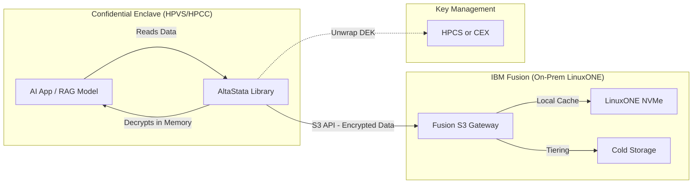

# IBM Fusion Integration for AltaStata

## Overview

IBM Fusion (formerly IBM Spectrum Fusion) is a software-defined storage platform based on **OpenShift Data Foundation (ODF)** and **Ceph**. It runs on-prem on **LinuxONE** hardware and provides an S3-compatible API.

**Key difference from cloud providers:** Fusion is on-prem, not IBM Cloud.

| | IBM Fusion | IBM Cloud COS | MinIO |
|:--|:-----------|:--------------|:------|
| **Location** | On-prem (LinuxONE) | IBM Cloud | On-prem or Cloud |
| **Based On** | ODF / Ceph (NooBaa MCG) | IBM Proprietary | Custom |
| **Data API** | S3-compatible | S3-compatible | S3-compatible |
| **Admin API** | `noobaa-mgmt` RPC + S3 SDK | IBM IAM | `mc` CLI |

## Secure Overlay

AltaStata uses a **Secure Overlay** on Fusion:

- **IBM Fusion** handles physical storage and movement of bytes (S3 API, local NVMe cache, tiering).
- **AltaStata** handles logical security — encryption, key wrapping, and access control before data reaches Fusion.

Fusion only ever sees encrypted blobs; plaintext exists only inside the confidential compute enclave (HPVS/HPCC) after AltaStata decrypts.



## Data Flow

**Write (ingest):**
1. AltaStata generates a DEK (AES-256) and encrypts the chunk inside the enclave.
2. DEK is wrapped with the user's public key (RSA-4096).
3. Encrypted chunk + wrapped DEK are uploaded via the Fusion S3 endpoint.
4. Fusion stores the blob locally (NVMe) or tiers it — never sees plaintext.

**Read (retrieval / RAG):**
1. AltaStata fetches the encrypted object from Fusion (cache hit on local NVMe is fast).
2. Wrapped DEK is unwrapped via HPCS/CEX (or software key in HPVS).
3. Data is decrypted inside the enclave before the application sees it.


```
┌──────────────────────────────────────────────────────────────────────────┐
│  AltaStata on IBM Fusion                                                 │
│                                                                          │
│  ┌────────────────────────────────────────────────────────────────────┐  │
│  │  COMPUTE: HPCC (OpenShift) or HPVS                                 │  │
│  │  • FusionCloudObjectHandler runs here                              │  │
│  │  • Memory encrypted by Secure Execution                            │  │
│  └────────────────────────────────────────────────────────────────────┘  │
│                              │                                           │
│              ┌───────────────┴───────────────┐                          │
│              ▼                               ▼                          │
│  ┌─────────────────────────┐    ┌─────────────────────────┐            │
│  │  STORAGE: IBM Fusion    │    │  KEYS: HPCS or CEX      │            │
│  │  • S3 Gateway           │    │  • RSA-4096 Private Key │            │
│  │  • Per-user buckets     │    │  • FIPS 140-2 Level 4   │            │
│  │  • Local NVMe cache     │    │                         │            │
│  └─────────────────────────┘    └─────────────────────────┘            │
└──────────────────────────────────────────────────────────────────────────┘
```

## Bucket Structure

Each user gets their own set of buckets (same pattern as MinIO/IBM COS):

```
altastata-{org}-catalog-{username}        # User's file catalog
altastata-{org}-chunks-{username}         # User's encrypted chunks
altastata-{org}-changes-{username}        # User's change logs
altastata-{org}-dataattributes-{username} # User's data attributes
altastata-{org}-users-all                 # Shared user metadata (read-only)
```

## Configuration

### User Properties

```properties
# Account type
accounttype=fusion-secure

# Fusion S3 Gateway endpoint
fusion-endpoint=https://s3.openshift-storage.svc

# S3 credentials (RSA encrypted OR plain text - auto-detected)
fusion-access-key=<RSA_ENCRYPTED_OR_PLAIN>
fusion-secret-key=<RSA_ENCRYPTED_OR_PLAIN>

# Bucket prefix
acccontainer-prefix=altastata-{org}-

# User identity
myuser={username}
metadata-encryption=RSA
```

**Note:** Fusion credentials can be either RSA-encrypted or plain text. The system automatically tries RSA decryption first; if it fails, credentials are used as plain text. This allows users to manage their own credentials without admin involvement.

### Admin properties

Provision Fusion / NooBaa users and buckets with the **Admin Tool** — see
[ADMIN_TOOL_GUIDE.md](../../../../../../../../docs/guides/ADMIN_TOOL_GUIDE.md). The same
account properties work against upstream NooBaa (kind, GKE) or Fusion on
OpenShift.

```properties
# MCG / NooBaa S3 endpoint (data plane + bucket lifecycle)
fusion-endpoint=https://s3.openshift-storage.svc

# System admin credentials from `noobaa status --show-secrets`
# (or the noobaa-admin Kubernetes Secret)
fusion-admin-access-key=admin-access-key
fusion-admin-secret-key=admin-secret-key

# Optional dev-only: trust kind+NooBaa self-signed cert
# fusion-disable-ssl-verification=true
```

Per-user NooBaa accounts and the four AltaStata buckets are created when
you run the Admin Tool against a Fusion / NooBaa endpoint.

## Java Dependencies

Data access uses the AWS S3 SDK against Fusion's S3-compatible endpoint
(already present transitively via `altastata-core`):

```xml
<dependency>
    <groupId>software.amazon.awssdk</groupId>
    <artifactId>s3</artifactId>
    <version>2.25.0</version>
</dependency>
```

Administration does **not** use the AWS IAM SDK. The Admin Tool creates
per-user NooBaa accounts via the NooBaa management API.

## Usage

### From Scala/Java Code

```scala
import com.altastata.cloud.fusion.FusionCloudObjectHandler
import com.altastata.utils.Account

implicit val account: Account = new Account()
account.loadUserProperties(userPropertiesPath)

val fusionHandler = new FusionCloudObjectHandler()

// Store encrypted data
fusionHandler.storeObjectToCloud(
  encryptedData,
  "altastata-myorg-chunks",
  "bob123",
  "file-001.chunk"
)

// Retrieve encrypted data
val data = fusionHandler.retrieveObjectFromCloud(
  "altastata-myorg-chunks",
  "bob123", 
  "file-001.chunk"
)
```

## Administration

Use the Admin Tool to provision Fusion / NooBaa — see
[ADMIN_TOOL_GUIDE.md](../../../../../../../../docs/guides/ADMIN_TOOL_GUIDE.md). For each
user it creates the four AltaStata buckets, writes `*user.properties`
(credentials encrypted to the user's public key), and uploads metadata
to `altastata-{org}-users-all`.

The system admin S3 keys come from `noobaa status --show-secrets`
upstream (the `noobaa-admin` Kubernetes Secret on Fusion). The AWS IAM
SDK is **not** used here; the Admin Tool creates per-user NooBaa
accounts via the NooBaa management API.

## Credential Handling

Fusion credentials are **auto-detected**:
1. System tries RSA decryption first
2. If decryption fails → credentials are used as plain text

This supports two workflows:

| Workflow | Credentials In Properties | How It Works |
|:---------|:-------------------------|:-------------|
| **Admin-Provisioned** | RSA encrypted | Admin encrypts with user's public key |
| **User-Managed** | Plain text | User fills in their own credentials |

### User-Managed Flow (Recommended)

```
Admin:                              User:
┌────────────────────┐              ┌────────────────────────────────┐
│ 1. Create buckets  │              │ Already has Fusion credentials │
│ 2. Set policies    │──skeleton──▶ │ (same as other apps)           │
│    (by user name)  │   file       │                                │
│                    │              │ 3. Fill in credentials (plain) │
│ Admin never sees   │              │ 4. Use AltaStata               │
│ user credentials!  │              │                                │
└────────────────────┘              └────────────────────────────────┘
```

### Why User-Managed is Better

- User already has Fusion credentials for other applications
- Admin doesn't need to handle user credentials
- Same credentials work across all user's applications
- Auto-detection handles both encrypted and plain credentials

## Comparison with Other Providers

| Feature | AWS | IBM Cloud COS | MinIO | **Fusion** |
|:--------|:----|:--------------|:------|:-----------|
| **Users** | IAM Users | Service IDs | `mc admin user` | NooBaa accounts (`noobaa-mgmt` RPC) |
| **Buckets** | Shared (prefix) | Per-user | Per-user | Per-user |
| **Policies** | IAM Policies | IAM Policies | MinIO Policies | Per-bucket NooBaa policies |
| **Admin API** | AWS IAM SDK | IBM IAM SDK | MinIO admin API | `noobaa-mgmt` JSON-RPC + S3 SDK |
| **Provisioning** | Admin Tool | Admin Tool | Admin Tool | Admin Tool |
| **User-Managed Credentials** | No | No | No | Yes (RSA-encrypted or plain) |

## Security Benefits

| Feature | Without Fusion | **With AltaStata + Fusion** |
|:--------|:---------------|:------------------------------|
| **Data locality** | High latency to cloud | Local cache on LinuxONE (PCIe speed) |
| **Security** | Trust cloud provider | Zero trust — encrypted before Fusion sees it |
| **Portability** | Hardcoded to one cloud | Fusion abstracts the backend |
| **RAG performance** | Slow retrieval | Fast retrieval from local NVMe cache |

Additional properties:

1. **Data Residency:** Data stays on your LinuxONE hardware
2. **Local Cache:** Fast RAG retrieval from NVMe (vs. network latency)
3. **Confidential Computing:** Integrates with HPCS/CEX for key management
4. **Zero Trust:** AltaStata encrypts before Fusion sees the data

## User Key Management

User credentials and keys can be generated and managed via the AltaStata Desktop UI or CLI:
- Create account keys: `altastata account create --type rsa --out <dir>`
- Update passphrase: `altastata account change-password --account-dir <dir>`

## Related Documents

- **Key Management:** `HSM_Key_Management.md`
- **Terminology:** `IBM_Hyper_Protect_Glossary.md`

