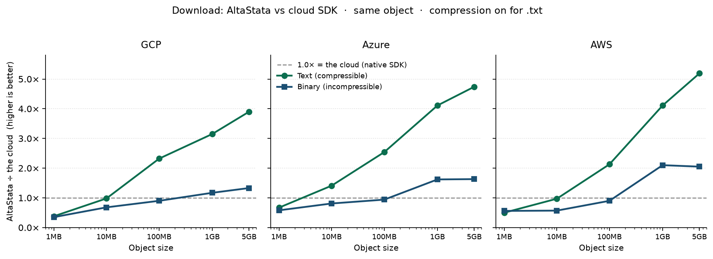

# Performance (download, TRIMMED)



Small objects (1–10MB) are slower than the SDK. From **100MB** compressible text pulls ahead; **1GB+** is the headline.

**Download** wall-clock in **ms**. Every timed cell is a pair:

**Text / Binary** — compressible text (`.txt`, AltaStata compression on) vs
incompressible binary (`.bin`, no compression gain).

| Column | Meaning |
|--------|---------|
| **Native GCS / Azure / S3 ↓** | Direct cloud SDK download (no AltaStata) |
| **AltaStata (GCP / Azure / AWS) ↓** | Same object downloaded **through AltaStata** on that cloud |
| **vs** | AltaStata ÷ native **throughput** (higher is better) |

Object keys keep `.txt` / `.bin` at the end so AltaStata `compresstypes`
(`.*.(txt|csv|parquet)`) applies to text.

Accounts: `google.rsa.bob123` / `azure.rsa.bob123` / `amazon.rsa.bob123`.

<!-- LIVE_TABLE_START -->

## GCP

| Size | Native GCS ↓<br/>Text / Binary | AltaStata (GCP) ↓<br/>Text / Binary | vs<br/>Text / Binary |
|------|------|------|------|
| 1MB | 165 ms / 170 ms | 436 ms / 472 ms | 0.38x / 0.35x |
| 10MB | 577 ms / 584 ms | 588 ms / 853 ms | 0.98x / 0.68x |
| 100MB | 3808 ms / 3656 ms | 1642 ms / 4053 ms | **2.32x** / 0.90x |
| 1GB | 36381 ms / 36580 ms | 11557 ms / 31382 ms | **3.15x** / **1.17x** |
| 5GB | 211577 ms / 222161 ms | 54222 ms / 167362 ms | **3.90x** / **1.33x** |

## Azure

| Size | Native Azure ↓<br/>Text / Binary | AltaStata (Azure) ↓<br/>Text / Binary | vs<br/>Text / Binary |
|------|------|------|------|
| 1MB | 148 ms / 188 ms | 212 ms / 289 ms | 0.67x / 0.58x |
| 10MB | 625 ms / 757 ms | 444 ms / 899 ms | **1.41x** / 0.81x |
| 100MB | 5448 ms / 5285 ms | 2192 ms / 5616 ms | **2.54x** / 0.94x |
| 1GB | 51177 ms / 54043 ms | 12448 ms / 33303 ms | **4.11x** / **1.62x** |
| 5GB | 261479 ms / 259807 ms | 55129 ms / 159007 ms | **4.74x** / **1.63x** |

## AWS

| Size | Native S3 ↓<br/>Text / Binary | AltaStata (AWS) ↓<br/>Text / Binary | vs<br/>Text / Binary |
|------|------|------|------|
| 1MB | 152 ms / 190 ms | 283 ms / 319 ms | 0.50x / 0.56x |
| 10MB | 518 ms / 508 ms | 534 ms / 903 ms | 0.97x / 0.57x |
| 100MB | 4175 ms / 4453 ms | 1964 ms / 4967 ms | **2.13x** / 0.90x |
| 1GB | 50132 ms / 67718 ms | 12196 ms / 32312 ms | **4.11x** / **2.10x** |
| 5GB | 362185 ms / 317718 ms | 69841 ms / 154676 ms | **5.19x** / **2.05x** |

<!-- LIVE_TABLE_END -->

## How to run

```bash
# Full suite (GCP → Azure → AWS, smoke then large)
./altastata-examples/scripts/run-all-clouds-performance.sh

# Or per cloud
./altastata-examples/scripts/run-gcp-performance-smoke.sh
./altastata-examples/scripts/run-gcp-performance-large.sh
./altastata-examples/scripts/run-azure-performance-smoke.sh
./altastata-examples/scripts/run-azure-performance-large.sh
./altastata-examples/scripts/run-aws-performance-smoke.sh
./altastata-examples/scripts/run-aws-performance-large.sh
```

Profiles: **smoke** = 1MB–100MB; **large** = 1GB/5GB.
Override heap: `PERF_MAX_HEAP=10g` (large default). Live table: `docs/README-performance-LIVE.md`.
