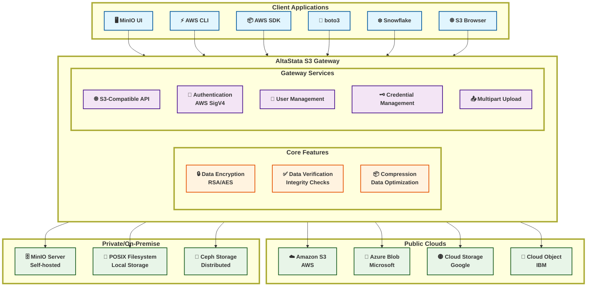

# AltaStata S3 Gateway Architecture

This diagram shows the overall architecture of the AltaStata S3 Gateway, including client applications, core features, gateway services, and supported cloud storage providers.

## Architecture Overview

### Client Applications
The AltaStata S3 Gateway supports any S3-compatible client:
- **MinIO UI** - Web-based interface for MinIO
- **AWS CLI** - Command-line interface for AWS services
- **AWS SDK** - Software development kits for various languages
- **boto3** - Python SDK for AWS services
- **Snowflake** - Data warehouse platform
- **S3 Browser** - GUI client for S3 storage

### AltaStata S3 Gateway

#### Core Features
- **🔒 Data Encryption** - RSA/AES encryption for data security
- **✅ Data Verification** - Integrity checks to ensure data consistency
- **📦 Compression** - Data optimization for efficient storage

#### Gateway Services
- **🌐 S3-Compatible API** - Full S3 protocol compatibility
- **🔐 Authentication** - AWS SigV4 signature validation
- **👤 User Management** - Multi-tenant user support
- **🗝️ Credential Management** - Secure access key management
- **📤 Multipart Upload** - Support for large file uploads

### Cloud Storage Providers

#### Public Clouds
- **Amazon S3** (AWS)
- **Azure Blob Storage** (Microsoft)
- **Google Cloud Storage** (GCP)
- **IBM Cloud Object Storage**

#### Private/On-Premise
- **MinIO Server** (Self-hosted)
- **POSIX Filesystem** (Local storage)
- **Ceph Storage** (Distributed storage)

## Key Benefits

1. **Universal Compatibility** - Any S3-compatible client can connect
2. **Multi-Cloud Support** - Single interface to multiple cloud providers
3. **Enhanced Security** - Encryption, verification, and authentication
4. **Data Optimization** - Compression and integrity checks
5. **Seamless Integration** - No client-side changes required
