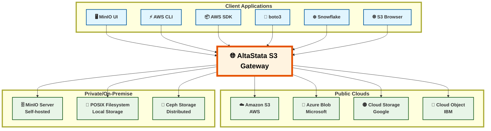

# AltaStata S3 Gateway Simplified Architecture

This diagram shows a simplified version of the AltaStata S3 Gateway architecture, with all gateway components at the same level without nested subgraphs.

## Architecture Overview

### Client Applications
The AltaStata S3 Gateway supports any S3-compatible client:
- **MinIO UI** - Web-based interface for MinIO
- **AWS CLI** - Command-line interface for AWS services
- **AWS SDK** - Software development kits for various languages
- **boto3** - Python SDK for AWS services
- **Snowflake** - Data warehouse platform
- **S3 Browser** - GUI client for S3 storage

### AltaStata S3 Gateway
The gateway acts as a transparent proxy that provides S3-compatible access to multiple cloud storage providers while adding security, optimization, and management capabilities.

### Cloud Storage Providers

#### Public Clouds
- **Amazon S3** (AWS)
- **Azure Blob Storage** (Microsoft)
- **Google Cloud Storage** (GCP)
- **IBM Cloud Object Storage**

#### Private/On-Premise
- **MinIO Server** (Self-hosted)
- **POSIX Filesystem** (Local storage)
- **Ceph Storage** (Distributed storage)

## Key Benefits

1. **Universal Compatibility** - Any S3-compatible client can connect
2. **Multi-Cloud Support** - Single interface to multiple cloud providers
3. **Enhanced Security** - Encryption, verification, and authentication
4. **Data Optimization** - Compression and integrity checks
5. **Seamless Integration** - No client-side changes required
