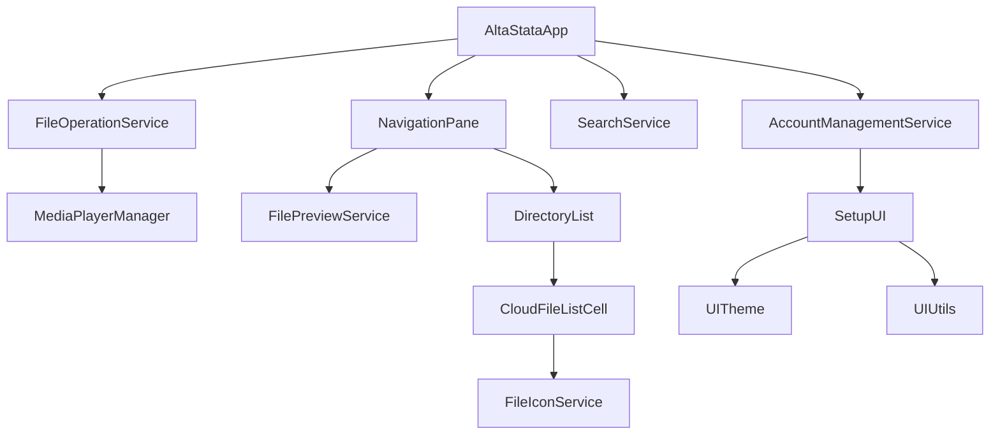

# AltaStata UI Module

The AltaStata UI module provides a JavaFX-based desktop application for multi-cloud file management with advanced cryptographic features. This module serves as the primary user interface for the AltaStata cloud storage system.

## Architecture Overview

The UI module follows a service-oriented architecture with clear separation of concerns:

```
┌─────────────────┐    ┌──────────────────┐    ┌─────────────────┐
│   AltaStataApp  │────│  Service Layer   │────│  Core Library   │
│   (Main App)    │    │                  │    │                 │
└─────────────────┘    └──────────────────┘    └─────────────────┘
         │                       │                       │
         ▼                       ▼                       ▼
┌─────────────────┐    ┌──────────────────┐    ┌─────────────────┐
│ UI Components   │    │ Business Logic   │    │ File Operations │
│ • NavigationPane│    │ • AccountMgmt    │    │ • Cloud Storage │
│ • DirectoryList │    │ • FileOps        │    │ • Cryptography  │
│ • SetupUI       │    │ • Search         │    │ • Multi-cloud   │
└─────────────────┘    └──────────────────┘    └─────────────────┘
```

## Main Classes

### Core Application
- **`AltaStataApp`** - Main JavaFX application class and entry point
- **`NavigationPane`** - Primary file navigation and browsing interface  
- **`DirectoryList`** - File/directory listing with custom cell rendering

### Service Layer
- **`AccountManagementService`** - User account operations and authentication
- **`FileOperationService`** - File upload, download, share, delete operations
- **`SearchService`** - File search and filtering functionality
- **`FilePreviewService`** - File content preview (text, images, PDF, media)
- **`MediaPlayerManager`** - UI feedback through button opacity management

### UI Components
- **`SetupUI`** - Account configuration and setup dialogs
- **`UserGroupsSetup`** - User group management interface
- **`PasswordDialog`** - Secure password input dialogs
- **`AutocompleteCombobox`** - Enhanced ComboBox with autocomplete
- **`SearchList`** - Search results display component

### Account Management
- **`RSAUserAccountSetupHandler`** - RSA cryptographic account setup
- **`PQCUserAccountSetupHandler`** - Post-quantum cryptography account setup

### Theming and Styling
- **`UITheme`** - Centralized theme configuration (colors, spacing, styles)
- **`UIStyleFactory`** - Factory for consistent UI component styling
- **`CloudFileListCell`** - Custom cell renderer for file lists with icons

### Utilities
- **`UIUtils`** - Common UI utility methods and dialogs
- **`FileIconService`** - File type icon management with caching

## Key Features

### 🔐 **Multi-Cryptography Support**
- **RSA** - Traditional public-key cryptography
- **Post-Quantum Cryptography (PQC)** - Future-proof quantum-resistant algorithms
- **HSM** - Hardware Security Module integration

### ☁️ **Multi-Cloud Storage**
- Amazon S3
- Google Cloud Storage  
- Azure Blob Storage
- Local filesystem

### 🎯 **Advanced File Operations**
- Drag-and-drop file upload
- Version-aware file management
- Encrypted file sharing with users/groups
- Real-time file preview (text, images, PDF, media)
- File search and filtering

### 📱 **Responsive Design**
- Desktop and mobile navigation modes
- Automatic layout adaptation
- Touch-friendly interface elements

## Application Flow

### 1. **Application Startup**
```java
AltaStataApp.main() 
    → start()
    → Initialize services (Account, FileOps, Search)
    → AccountManagementService.selectAccount()
```

### 2. **Account Selection & Setup**
```
Account Selection Dialog → Account Configuration → Key Generation/Loading → Properties Setup
```

### 3. **File Operations**
```
NavigationPane → FileOperationService → Core Library → Cloud Storage
```

### 4. **Search Operations**
```
Search Input → SearchService → Core Library → Results Display
```

## Service Dependencies



## Configuration

### Account Types
The application supports three account types:

1. **RSA Accounts** - Traditional RSA encryption
   - Account name must contain "rsa"
   - Uses RSAUserAccountSetupHandler
   
2. **PQC Accounts** - Post-quantum cryptography
   - Account name must contain "pqc" 
   - Uses PQCUserAccountSetupHandler
   
3. **HSM Accounts** - Hardware security modules
   - Account name must contain "hsm"
   - No password required

### Properties Configuration
Account properties are stored in `account.properties` files:
```properties
# Cloud provider settings
aws.access.key.id=YOUR_ACCESS_KEY
aws.secret.access.key=YOUR_SECRET_KEY
aws.region=us-east-1
aws.s3.bucket=your-bucket-name

# User identification
myuser=username
organization=your-org

# Optional Cognito settings
cognito-fed-identity-pool-id=pool-id
cognito-identity-id=identity-id
```

## Building and Running

### Prerequisites
- Java 17+
- JavaFX SDK 17+
- Gradle

### Build Commands
```bash
# Build the UI module
gradle :altastata-ui:build

# Create modular runtime
gradle :altastata-ui:runtime

# Create installer packages  
gradle :altastata-ui:jpackage

# Run the application
./build/image/bin/AltaStataUI
```

### VM Options (for development)
```
--module-path=/path/to/javafx-sdk-17/lib 
--add-modules=javafx.controls,javafx.web,javafx.media,javafx.graphics
```

## Styling and Theming

The application uses a centralized theming system:

### UITheme Constants
- **Colors**: `HEADER_BACKGROUND`, `DIALOG_BACKGROUND`
- **Padding**: `PADDING_SMALL`, `PADDING_LARGE_DIALOG`  
- **Sizes**: `ICON_SIZE_TOOLBAR`
- **Styles**: `DIALOG_BOX_STYLE`, `TRANSPARENT_TILE_STYLE`

### CSS Files
- `css/HeaderList.css` - List view styling
- `css/ListView.css` - General list styling  
- `css/Toolbar.css` - Toolbar component styling

## File Preview Support

The FilePreviewService supports multiple file types:

- **Text Files** - Syntax highlighting and encoding detection
- **Images** - JPEG, PNG, GIF, BMP preview
- **PDF Documents** - Rendered preview using PDFBox
- **Audio/Video** - Media player integration (JavaFX + VLCJ)

## Error Handling

The application provides comprehensive error handling:

- **User-friendly dialogs** for common errors
- **Detailed logging** for troubleshooting
- **Graceful degradation** for missing features
- **Progress feedback** for long-running operations

## Security Features

- **End-to-end encryption** for all file operations
- **Secure password handling** with memory clearing
- **Certificate validation** and key management
- **User access control** and sharing permissions

## Performance Optimizations

- **Icon caching** for improved file list rendering
- **Lazy loading** of file previews
- **Background threading** for I/O operations
- **Memory-efficient** file streaming

## Troubleshooting

### Common Issues

1. **JavaFX Module Path Issues**
   - Ensure JavaFX is properly configured
   - Use correct module-path and add-modules flags

2. **Account Loading Errors**  
   - Check account.properties file format
   - Verify cloud provider credentials
   - Ensure account directory permissions

3. **File Operation Failures**
   - Verify network connectivity
   - Check cloud storage permissions
   - Review error messages in logs

### Logging
The application uses SLF4J with Logback configuration in `logback.xml`.

## Contributing

When contributing to the UI module:

1. **Follow the service pattern** - Create focused service classes
2. **Use UITheme constants** - Don't hardcode styling values
3. **Add proper JavaDoc** - Document public methods and classes
4. **Maintain separation of concerns** - Keep UI logic separate from business logic
5. **Test across platforms** - Verify JavaFX compatibility

## Related Modules

- **altastata-core** - Core file system and cryptography logic
- **altastata-s3-gateway** - S3-compatible REST API gateway
- Admin Tool (installer, not in this tree) — [ADMIN_TOOL_GUIDE.md](../docs/guides/ADMIN_TOOL_GUIDE.md)

### Desktop & Platform Applications

- **altastata-ui** - JavaFX desktop application
- **altastata-hadoop** - Hadoop/Spark integration with shadow JAR support
- **altastata-examples** - CLI examples with GraalVM native image support

### Cloud Infrastructure