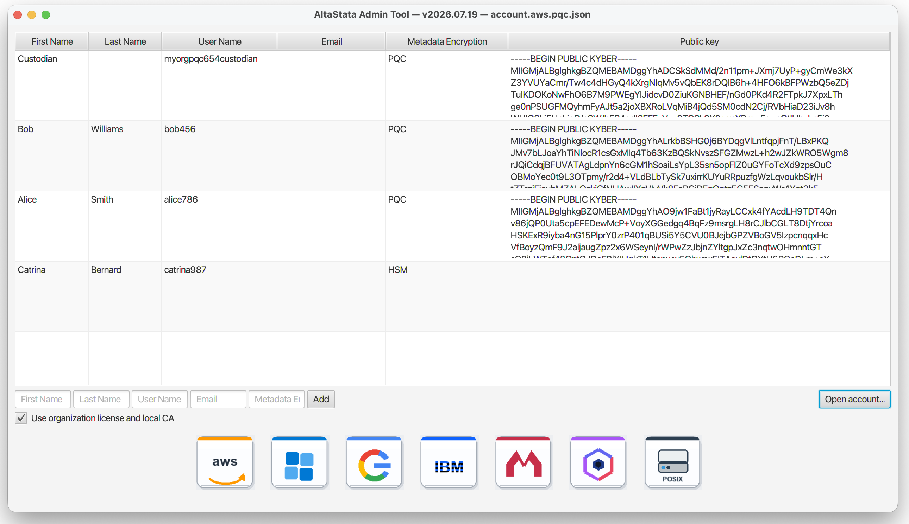

# AltaStata Admin Tool Installation & Usage Guide

The Admin Tool (`altastata-admin`) provisions storage and wraps credentials
for end users. It does **not** generate user private keys — users create those
themselves ([USER_SETUP_GUIDE.md](USER_SETUP_GUIDE.md)).

The CLI is the separate
[`altastata` Python package](https://github.com/AltaStata/altastata-python-package).

### How accounts are created

1. **User** creates keys and sends you the **public key**.
2. **You** provision the fabric (this guide) and send each user a
   `*user.properties` file.
3. **User** pastes it into **Account Properties** in the Desktop UI, or drops
   the file next to their keys.



## 1. Installation

Download the **Admin Tool** installer (`AltaStata-Admin-…`) from
[GitHub Releases](https://github.com/AltaStata/sovereign-data-fabric/releases):

- **Mac (Apple Silicon):** `AltaStata-Admin-*-mac-arm64.dmg`. Intel Mac and Linux
  installers are not published; contact us or build from source
  ([DEVELOPERS_GUIDE.md](DEVELOPERS_GUIDE.md)).
- **Windows (x64):** `AltaStata-Admin-*-windows-x64.exe`.

If Gatekeeper / SmartScreen warns: macOS **Privacy & Security → Open Anyway**;
Windows **More info → Run anyway**. Desktop installers bundle a JVM. Services
and Hadoop JARs from Releases need **Java 17+**.

End-user **Desktop UI** installers are separate assets on the same Releases page
(`AltaStata-UI-…`) — see [USER_SETUP_GUIDE.md](USER_SETUP_GUIDE.md).

---

## 2. Community vs Enterprise

One binary, two modes. Who owns vs who governs a file:
**[ENTERPRISE.md](ENTERPRISE.md)** (includes CISO / egress).

| Mode | Admin UI | License JWT | Certificate signing |
|------|----------|-------------|---------------------|
| **Community** | "Use organization license…" unchecked | not required | AltaStata cloud CA (`POST /sign`) — **RSA only**, up to 5 users + 1 custodian |
| **Enterprise / eval** | "Use organization license…" checked | present under `licenses/` | Your **local org CA** (never AltaStata `/sign`) — RSA, PQC, HSM/HPCS per license |

Under the user table:

1. **Use organization license and local CA** — on only if
   `~/.altastata/admin/licenses/altastata-{org}.jwt` exists
   (`useOrganizationLicense` in account JSON).
2. **Enterprise Custodian mode** — same JWT gate. Saved as
   `enterpriseCustodianMode` in account JSON and stamped into user properties
   as `enterprise-custodian-mode=true`. Login then needs `license.jwt` with
   feature `custodian`. Turning off organization license also turns this off.

### Enterprise files (`~/.altastata/admin/` or `$ALTASTATA_HOME/admin/`)

```text
~/.altastata/admin/
├── licenses/
│   └── altastata-{org}.jwt     # required for Enterprise / eval
├── org-ca.pem                  # org CA public key
├── org-ca-private.key          # plaintext org CA private key (optional if .enc is used)
└── org-ca-private.key.enc      # password-encrypted org CA private key (optional)
```

`{org}` is the lowercase organization name in `account.json` (example:
`myorgrsa444` → `altastata-myorgrsa444.jwt`). AltaStata issues the JWT
(seats, expiry, features `pqc` / `hsm` / `hpcs` / `custodian`); it is **not**
inside the installer. Without it, both checkboxes stay off (Community) even if you load a
PQC-oriented account JSON.

Admin prefers `org-ca-private.key.enc` over `.key`. If `.enc` is present,
**Run** asks for the passphrase, decrypts in memory, then signs. Plaintext
`.key` needs no pop-up. After provisioning, copy `license.jwt` and
`org-ca.pem` into each user’s account folder. Keep the org CA **private** key
only on Admin home and the **custodian** account.

Cognito / self-enroll: also copy the org CA private key (or `.enc`) into the
custodian folder so the custodian can sign new-user certificates. Without it,
Cognito enrollment cannot complete on a licensed lake.

```bash
openssl genrsa -out ~/.altastata/admin/org-ca-private.key 4096
chmod 600 ~/.altastata/admin/org-ca-private.key

openssl rsa -in ~/.altastata/admin/org-ca-private.key -aes256 \
  -out ~/.altastata/admin/org-ca-private.key.enc
chmod 600 ~/.altastata/admin/org-ca-private.key.enc
```

Enter the passphrase at the OpenSSL prompt (not on the command line). Admin
asks for the same passphrase on **Run**.

### Community

Own-cloud / internal storage only; not for a customer or partner account
([LICENSE.md](../../LICENSE.md)). RSA, up to **5 users** plus one org
custodian (username ending in `custodian`; does not count toward the 5).
No org CA or HSM.

1. Do **not** place a JWT under `licenses/`.
2. Open Admin → **Open account…** → load `account.rsa.json`.
3. Set **Metadata Encryption** to `RSA` for every user.
4. Paste each user’s **public key** into the table
   ([USER_SETUP_GUIDE.md](USER_SETUP_GUIDE.md)), then provision (§3).

### Enterprise

PQC, HSM/HPCS, local CA, and Custodian mode as granted in the JWT.

1. Install the license kit: `licenses/altastata-{org}.jwt`, `org-ca.pem`, and
   `org-ca-private.key` and/or `.enc`.
2. Open Admin → **Open account…** → load `account.pqc.json` (or your JSON)
   whose org name matches the JWT (`altastata-{org}`).
3. Check **Use organization license and local CA**. Optionally check
   **Enterprise Custodian mode** if the JWT has feature `custodian`.
4. Set **Metadata Encryption** to `PQC`, `HSM`, or `HPCS+RSA` as licensed.
   Paste each user’s **public key** into the table.
5. **Run** signs with the local org CA. Missing both private-key files →
   error (no `/sign` fallback). For `.enc`, enter the password on **Run**.

---

## 3. Provisioning Cloud Resources

1. Click a cloud logo (AWS, Azure, Google Cloud, IBM Cloud, MinIO, IBM Fusion, or POSIX).
2. Fill the `key=value` dialog (`#` lines are comments). Admin uses this only for
   the current **Run** — it is not saved on disk.
3. Click **Run**. Cloud backends call **your** provider APIs; POSIX only creates
   directories under `root-prefix`.

Output files: `~/.altastata/admin/properties.{cloud}/` ([§3.2](#32-output-paths)).
Organization name in `account.json` must be **lowercase alphanumeric**; buckets
become `altastata-{org}-…`.

### 3.1 Example dialog parameters (by backend)

Replace placeholder values. Do not commit real secrets to git.

#### AWS

Minimum dialog (add `region` and `kms_region` — required at runtime even though the default dialog shows only the access keys):

```properties
AWSAdminAccessKeyId=AKIA...
AWSAdminSecretKey=...
region=us-east-1
kms_region=us-east-1
# Optional — Cognito self-enroll (Enterprise):
# cognito_region=us-east-1
# Optional — corporate HTTP proxy:
# proxyHost=proxy.example.com
# proxyPort=8080
```

**Admin IAM user** needs permission to create S3 buckets, IAM users, access keys, and policies in your account (typical PoC: `AdministratorAccess` on a dedicated admin user; production: scoped custom policy).

#### Azure

```properties
azureAccount=myorgstorage
# Or full blob endpoint (both work — Admin normalizes bare names):
# azureAccount=https://myorgstorage.blob.core.windows.net
adminStorageConnectionString=DefaultEndpointsProtocol=https;AccountName=myorgstorage;AccountKey=...;EndpointSuffix=core.windows.net
# SAS token validity in years (customer policy; default 10)
sasValidityYears=10
```

**Storage account** needs permission to create containers and queues and to issue account SAS tokens (typical PoC: Storage Account Contributor + access to the account key).

#### Google Cloud (GCP)

Create a service-account JSON key in **your** project (Storage Admin + Pub/Sub
Admin). AltaStata does not ship this file. Store it outside git (`chmod 600`);
treat it like a password. Export it, then **launch Admin from the same shell**
(a desktop icon will not see the variable):

```bash
export GOOGLE_APPLICATION_CREDENTIALS="/path/to/your-service-account-key.json"
```

```properties
# GOOGLE_APPLICATION_CREDENTIALS must point at the JSON key file above
projectId=my-gcp-project
kms_location=us-central1
kms_key_ring=my-key-ring
```

`projectId` must match `project_id` in the JSON. `kms_key_ring` is a Cloud KMS
ring **you** create (dialog default: `altastata`).

#### IBM Cloud Object Storage

One-time setup: create an admin **service ID** with COS Manager + IAM Identity Administrator + IAM Policy Management Administrator, then generate **HMAC keys** (bucket ops) and a separate **IAM API key** (policy ops). Step-by-step IBM setup guide: `contact@altastata.com`.

Dialog (matches the Admin Tool IBM template):

```properties
# IAM API key from the admin service ID (create service IDs / access groups)
ibm-service-id-api-key=...

# IAM API key for policy operations (user or dedicated policy-admin key)
ibm-policy-api-key=...

# COS S3-compatible endpoint (region-specific)
ibm-cos-endpoint=https://s3.us.cloud-object-storage.appdomain.cloud

# HMAC credentials for bucket create/list (Manager on the COS instance)
ibm-cos-hmac-access-key-id=...
ibm-cos-hmac-secret-access-key=...

# COS service instance CRN
ibm-cos-service-instance-id=crn:v1:bluemix:public:cloud-object-storage:global:a/...:...

# IBM Cloud account ID
ibm-account-id=...
```

#### LocalFS / POSIX (shared filesystem)

One property: an **empty** absolute path every AltaStata client can read and
write. Production: NFS / NAS / file share, same `root-prefix` on every host.
PoC: a local folder is enough (dialog default `{user.home}/altastata-localfs`).

```properties
root-prefix=<absolute-path-to-empty-shared-directory>
```

- Linux NFS: `/mnt/nfs/altastata-lake`
- macOS share: `/Volumes/CorpNAS/altastata-lake`
- Windows mapped drive: `Z:\altastata-lake`
- One-machine PoC: `~/altastata-localfs` or `C:\Data\altastata-localfs`

Admin creates `altastata-{org}-users-all/` under that prefix. Walkthrough:
[§3.3](#33-evaluate-on-local-disk-posix--localfs).

#### MinIO and IBM Fusion (optional)

Same dialog pattern — defaults appear when you click the logo:

```properties
# MinIO
minio-endpoint=http://localhost:9000
minio-access-key=minioadmin
minio-secret-key=minioadmin
```

```properties
# IBM Fusion / NooBaa (OpenShift Data Foundation)
fusion-endpoint=https://s3.openshift-storage.svc
fusion-admin-access-key=...
fusion-admin-secret-key=...
# fusion-disable-ssl-verification=true   # lab / port-forward only
```

After **Run**, MinIO and Fusion also need a per-user bucket/policy step via companion scripts (included with the Enterprise Admin kit or on request from `contact@altastata.com`).

### 3.2 Output paths

After a successful **Run**, send each user their file from:

| Backend | Directory under `~/.altastata/admin/` |
|---------|----------------------------------------|
| AWS | `properties.amazon/` |
| Azure | `properties.azure/` |
| GCP | `properties.google/` |
| IBM COS | `properties.ibm/` |
| LocalFS | `properties.localfs/` |
| MinIO | `properties.minio/` |
| Fusion | `properties.fusion/` |

File name pattern: `altastata-{org}-{username}.user.properties`. Enterprise / eval: also copy `license.jwt` and `org-ca.pem` from the same directory into the user's runtime account folder.

<a id="33-evaluate-on-local-disk-posix--localfs"></a>

### 3.3 POSIX / LocalFS

POSIX / LocalFS stores data on a local or shared directory. Encryption, sharing, S3, and Spark work the same as on object
storage. Production often uses a shared NFS/NAS path ([§3.1](#31-example-dialog-parameters-by-backend)).
There is no self-service shortcut: POSIX is provisioned by the Admin Tool like
any other backend.

1. **User** — create keys and copy the public key
   ([USER_SETUP_GUIDE.md](USER_SETUP_GUIDE.md)).
2. **Admin** — Community, load `account.rsa.json`, add the user with that
   public key, click **POSIX**, set `root-prefix` to an **empty** directory,
   **Run**. Organization name must be lowercase.
3. Send `~/.altastata/admin/properties.localfs/altastata-{org}-{user}.user.properties`
   to the user (plus `license.jwt` and `org-ca.pem` for Enterprise / eval).
   It carries `accounttype=localfs-secure` and the `root-prefix`; no cloud
   credentials appear in it. They paste it into **Account Properties** or drop
   it next to their keys.
4. Open that account in Desktop UI, Web Console, Java
   ([HOWTO.md](HOWTO.md)), or Scala ([Low-level-Scala-API.md](Low-level-Scala-API.md)).

Community still contacts the AltaStata cloud CA, so the machine needs internet
even though the data never leaves it. Enterprise signs locally with your org CA.
