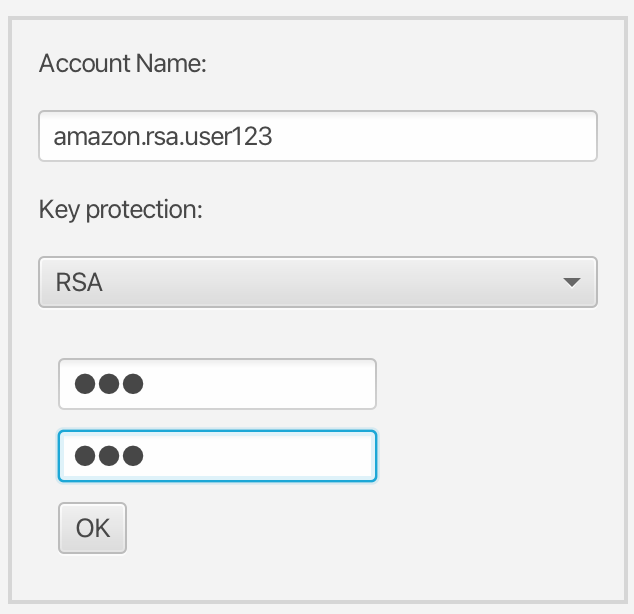
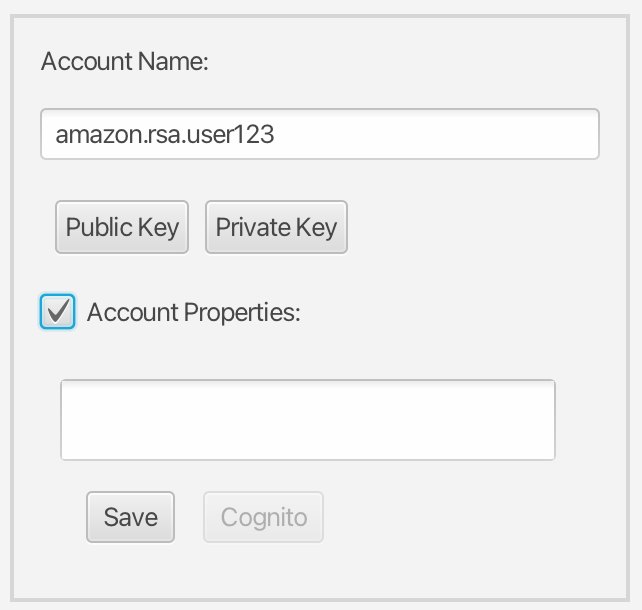

# AltaStata End-User Account Setup

Create keys, send the **public key** to your org admin, drop their
`*user.properties` next to your keys. The private key never leaves your machine.
Admins: **[ADMIN_TOOL_GUIDE.md](ADMIN_TOOL_GUIDE.md)**.

## Typical flow

1. **You** — keys via [Desktop UI](#desktop-ui-altastata-ui) or
   [Python CLI](#create-account-via-python-cli) (one account folder for Java,
   Scala, S3, gRPC, Python); send the **public key** to the admin.
2. **Admin** — provisions storage; sends you `*user.properties` from
   `~/.altastata/admin/properties.<cloud>/` ([ADMIN_TOOL_GUIDE §3.2](ADMIN_TOOL_GUIDE.md#32-output-paths)).
3. **You** — drop `*user.properties` in your account folder (or paste in Desktop **Account
   Properties**). Use any client: Desktop, Web Console, Java/Scala, S3, Python.

## Where files live

```text
~/.altastata/
├── accounts/<name>/              # you: keys, *.user.properties, license.jwt, org-ca.pem
├── application/logs/             # Desktop UI logs (bug reports)
└── services/logs/                # bundled gateway — Python pip, gRPC/S3 (bug reports)
```

Org admins: after **Run**, `altastata-{org}-{username}.user.properties` files are
under `~/.altastata/admin/properties.<cloud>/` (e.g. `properties.amazon/`,
`properties.localfs/`) — [ADMIN_TOOL_GUIDE §3.2](ADMIN_TOOL_GUIDE.md#32-output-paths).

Bug reports: attach redacted lines from the log folder for the client you use
([SUPPORT.md](../../SUPPORT.md)).

## Desktop UI (`altastata-ui`)

### 1. Create the account

1. Download `AltaStata-UI-…` from
   [Releases](https://github.com/AltaStata/sovereign-data-fabric/releases)
   (macOS `.dmg` or Windows `.exe`) and launch it.
2. **Create Account** / **Setup** → **Account Name** (e.g. `amazon.rsa.bob456`
   under `~/.altastata/accounts/`).
3. **Key protection**: RSA, PQC, or HPCS; passphrase (empty for HPCS) → **OK**.

PQC: Kyber / Dilithium key files. HPCS: `hpcs-privkey.blob`, `hpcs.marker`.



### 2. Send your public key to the admin

Account dialog → **Public Key** (copies to clipboard) → send to admin. Never
send the private key.



### 3. Install `*user.properties`

Paste into **Account Properties** → **Save**, or drop the file into the account
folder (`~/.altastata/accounts/<name>/`). Then use [HOWTO.md](HOWTO.md) or any
client (Java, S3, Python). Enterprise / eval: also `license.jwt` and `org-ca.pem`
if the admin provided them.

## Create account via Python CLI

[AltaStata python package](https://github.com/AltaStata/altastata-python-package)
CLI — same account folder for Java, Scala, S3, gRPC, and Python. Commands:
[Python USER_SETUP_GUIDE](https://github.com/AltaStata/altastata-python-package/blob/main/docs/guides/USER_SETUP_GUIDE.md).

## Security notes

- Never share private keys or commit account folders / passwords to git.
- Passphrase at every login (RSA/PQC); empty for HPCS/HSM.
- `GenerateKeys` needs a local-mode gateway (or explicit allow) on hosted setups.

## Related docs

| Document | Audience |
|----------|----------|
| [HOWTO.md](HOWTO.md) | Upload, download, share — Desktop, Console, Java, S3 |
| [Low-level-Scala-API.md](Low-level-Scala-API.md) | Scala `CloudFile` API |
| [ADMIN_TOOL_GUIDE.md](ADMIN_TOOL_GUIDE.md) | Org admin |
| [ENTERPRISE.md](ENTERPRISE.md) | Custodian, PQC, HSM/HPCS |
| [Python USER_SETUP_GUIDE](https://github.com/AltaStata/altastata-python-package/blob/main/docs/guides/USER_SETUP_GUIDE.md) | CLI / SDK key creation |
